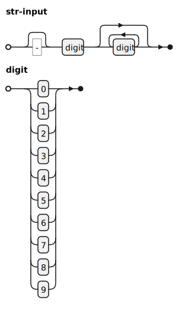

An implementation of arbitrary-precision integers in C++. This implementation uses an boolean array


# Installation
Add `bigint.hpp` to a directory in the include path. To include the file, write

```c_cpp
#include "bigint.hpp"
```

# Usage


To use the project, import `bigint::Int` from namespace `bigint`. The class `bigint::Int` has the following overloads:

```c_cpp
Int(const string &);
Int(const Int &);
Int(const bool &, const vector<bool> &);
```

The primary constructor `Int (const string &` accepts `string` inputs in the following syntax:

<p align="center">
	
</p>

## Operators

The `Int` class overloads the following operators. The side effects of these operators are listed as follows:

|Operator|Return Type |Effect|
|----|----|----|
|`ostream << a`|N/A|
|`a = b`| `Int`|Copy `b` then assign to `a`
|`- a`| `Int` | None, rerturn a new instance 
|`a + b`| `Int` | None, rerturn a new instance
|`a += b`| `void` |Modify `a` in-place
|`a - b`| `Int` | None, rerturn a new instance
|`a -= b`| `void` | Modify `a` in-place
|`a * b`| `Int` |None, rerturn a new instance
|`a *= b`| `void` |Modify `a` in-place
|`a / b`| `Int` |None, rerturn a new instance
|`a /= b`| `void` |Modify `a` in-place
|`a == b`| `bool` |None
|`a != b`| `bool` |None
|`a > b`| `bool` |None
|`a < b`| `bool` |None
|`a >= b`| `bool` |None
|`a <= b`| `bool` |None


The method `to_string(...)` is overloaded to accept `Int` instances. The method `Int.to_str_bools()` instead returns a `string` of boolean values. The latter is significantly faster for numbers that are larger than $2^{2^{70}}$, as it does not attempt the costly conversion to decimal numbers.

|Operator|Return Type | Effect|
|----|----|---|
|`std::to_string(a:Int)`| `std::string`|None|
|`Int.to_str_bools()`| `bool` | None |


# Examples
Create an instance of `Int`:
```
bigint::Int int_a("990000009999990099999999");
```

Print the value stored in the instnace `int_a`:
```
cout << int_a;
cout << to_string(int_a);
```

Declare two instances of `Int`, then print their product:
```
bigint::Int int_b("99999999");
bigint::Int int_c("-900009");
cout << "Multiplication: " 
     << int_b
     << "*" 
     << int_c
     << "="
     << (int_b * int_c)
     << "\n";
```
